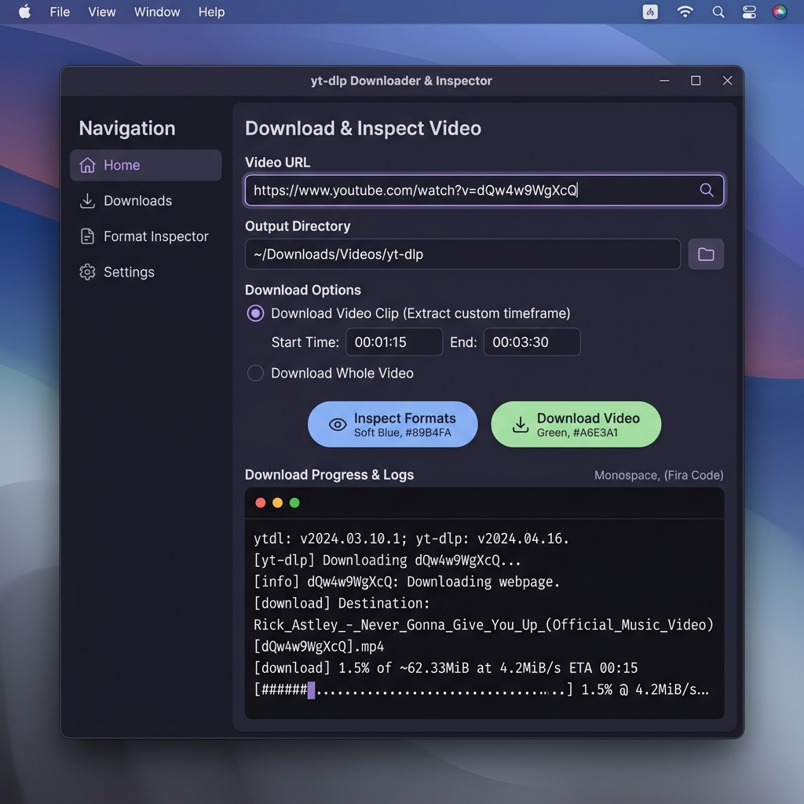

# 🎥 yt-dlp Video Downloader & Inspector

[](LICENSE)
[](https://github.com/Yerevl/yt-dlp-wrapper/releases)
[](https://python.org)

A modern, elegant desktop application built in Python using Tkinter, providing a powerful GUI wrapper around `yt-dlp` and `ffmpeg`. Designed with a clean Catppuccin-inspired dark theme and built-in Windows DPI scaling for crisp visuals.

---

## 📸 Application Screenshot



---

## 🚀 Download & Installation

### 1. Download the Standalone Executable (Windows)
The easiest way to use the downloader is to download the pre-compiled executable. It bundles python, `yt-dlp`, and `ffmpeg` inside a single executable—**no installation required!**

1. Go to the **[GitHub Releases](https://github.com/Yerevl/yt-dlp-wrapper/releases)** page.
2. Download the latest `downloader.exe` under the assets.
3. Double-click the file to run the application.

> [!NOTE]
> Since the executable is compiled using PyInstaller and is unsigned, Windows SmartScreen may show a warning ("Windows protected your PC"). Click **"More Info"** and then **"Run anyway"** to launch it.

### 2. Run from Source (Python)
If you prefer running from source:
1. Clone this repository:
   ```bash
   git clone https://github.com/Yerevl/yt-dlp-wrapper.git
   cd yt-dlp-wrapper
   ```
2. Make sure you have **Python 3.8+** installed.
3. Place `yt-dlp.exe`, `ffmpeg.exe`, and `ffprobe.exe` in the root of the project directory.
4. Run the launcher or script directly:
   * **Windows:** Double-click `run.bat` or run:
     ```bash
     pythonw downloader.py
     ```
   * **Other OS:**
     ```bash
     python downloader.py
     ```

---

## ✨ Key Features

* **🎨 Sleek Dark UI**: Beautifully designed dark surface using a curated slate-and-purple palette.
* **🖥️ High-DPI Aware**: Built-in Windows scaling prevents blurry fonts and buttons on modern displays.
* **📋 Smart URL Paste**: Instantly paste links from your clipboard with a single click.
* **⏱️ Custom Video Clipping**: Extract specific parts of a video (e.g. `00:01:20` to `00:02:15`) instead of downloading the whole file.
* **🔍 Video Formats Inspector**: List all available video resolutions, file formats, and audio streams for any video.
* **⚡ Interactive Log Terminal**: Includes a real-time console with detailed progress bars, speeds, and estimated completion times.
* **🖱️ Auto-Fill Format Selection**: Clicking any format row inside the inspector logs automatically copies and inserts the format code (e.g., `137+140`) into the setting box.
* **🛑 Threaded & Safe Execution**: Full asynchronous background downloads so the app never freezes, with a dedicated **Cancel / Stop** button to abort operations instantly.

---

## 🛠️ Build Your Own Executable
If you want to package the application yourself using PyInstaller:

1. Install PyInstaller:
   ```bash
   pip install pyinstaller
   ```
2. Run the build script using the bundled spec file:
   ```bash
   pyinstaller downloader.spec
   ```
3. The packaged `downloader.exe` will be generated inside the `dist/` directory.

---

## ⚖️ License & Acknowledgements
This project is open-source. Special thanks to the developers of:
* **[yt-dlp](https://github.com/yt-dlp/yt-dlp)** for the incredible video downloading tool.
* **[FFmpeg](https://ffmpeg.org/)** for the media parsing and cutting engine.
